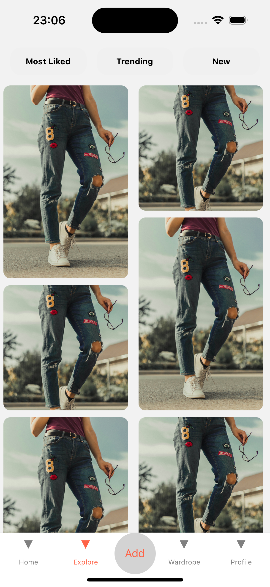

# react-native-asymmetric-image-grid

A React Native component that displays images in an asymmetric grid. The grid is responsive and the images are resized to fit the grid cells.

## Installation

```sh
npm install react-native-asymmetric-image-grid
```

## Usage

```js
import AsymmetricImageGrid from 'react-native-asymmetric-image-grid';

// ...

<AsymmetricImageGrid
  images={[
    { uri: 'https://example.com/image1.jpg' },
    { uri: 'https://example.com/image2.jpg' },
    { uri: 'https://example.com/image3.jpg' },
    { uri: 'https://example.com/image4.jpg' },
    { uri: 'https://example.com/image5.jpg' },
    { uri: 'https://example.com/image6.jpg' },
    { uri: 'https://example.com/image7.jpg' },
    { uri: 'https://example.com/image8.jpg' },
    { uri: 'https://example.com/image9.jpg' },
  ]}
/>
```

## Props

| Name | Type | Description |
| ---- | ---- | ----------- |
| images | Array<{ uri: string }> | An array of objects with a `uri` property that contains the image URL. |

## License

You can use this code under the [MIT License](LICENSE).

## ScreenShots




